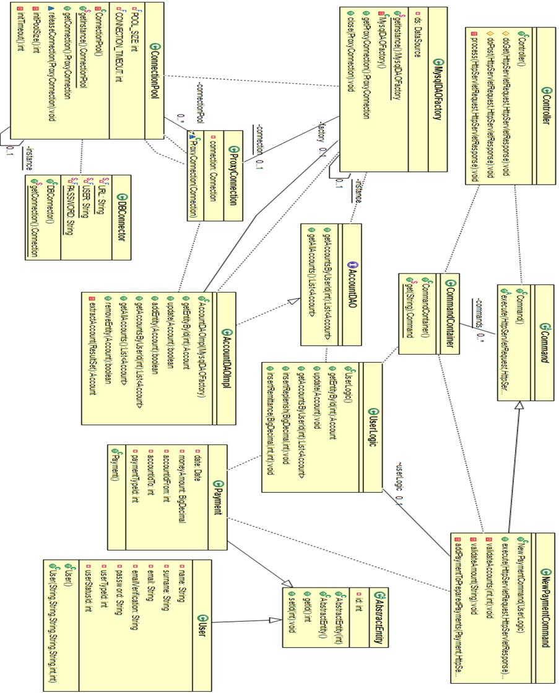
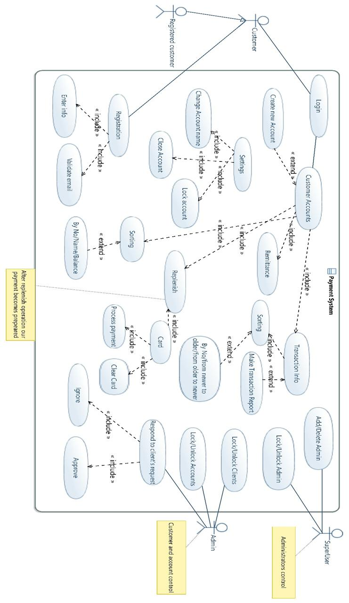
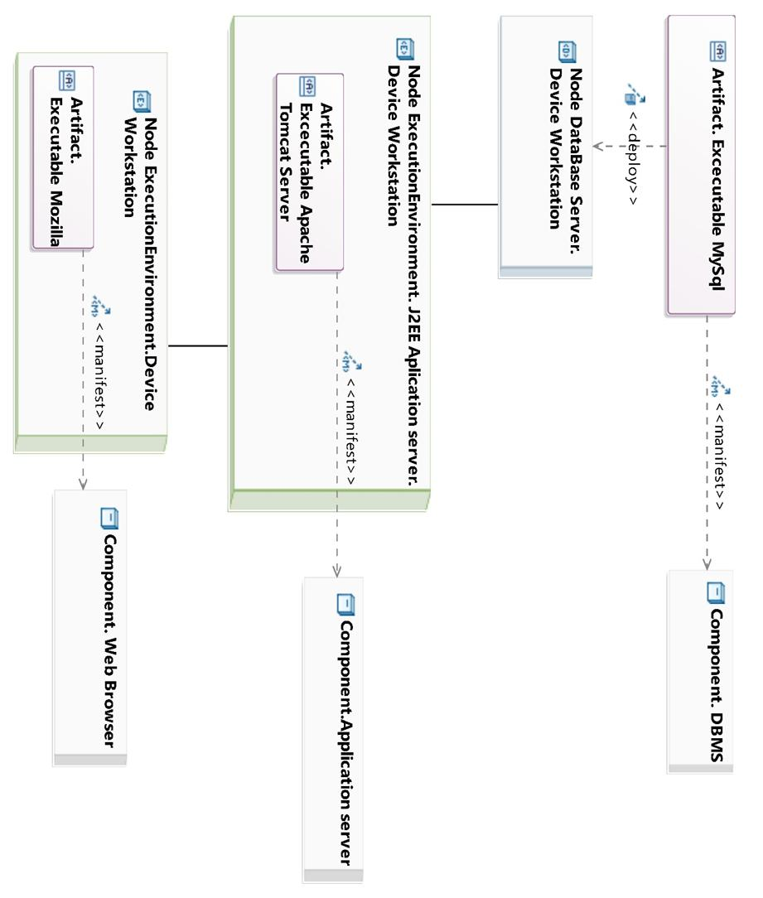
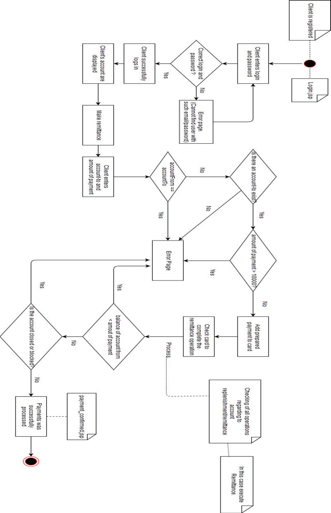
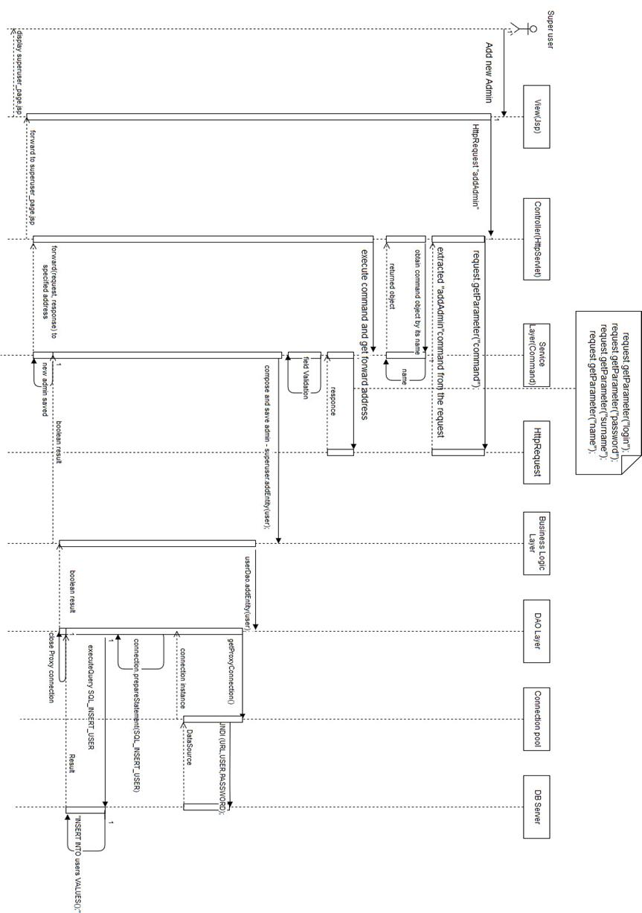

# WebPayment

5th semester project 

## Common Technologies
Project is created with:
* Servlet API
* JSP
* JDBC (MySql)
* Hibernate (for fun)
* web stack - (html , css , js)

### Payments

A client registers in the system and has one or several Credit Cards, each of which corresponds to a certain Account in the system.
The client can make a payment using an account. A payment has one of two statuses: 'prepared' or 'sent'.

Optionally: to realize the possibility of generating a pdf-report on payment.

The client has a personal account in which he can view information about his payments and bills.

Implement sorting:

payments

 * by number
 * by date (from old to new, from new to old)

accounts

 * by number
 * by account name
 * on balance

A client can replenish or block one of his accounts. To unblock an account, the client must make an unblocking request to the administrator.
The system administrator owns the rights to:
  * block / unlock user
  * blocking / unblocking any user accounts

Patterns and principles that I used in the project
<pre>
In designing an information system, I wanted to create a system that will be easy to maintain and expand over a long period of time.
To achieve this, I have tried to adhere to the <b>SOLID</b> and <b>GRASP</b> principles. In the resulting system, I also used 6 GOF patterns to help me solve certain problems in my system.
I used the <b>Abstract factory</b> template to support and simplify the work with different types of databases, for the time being I am using the relational database MySQL.
Another creational pattern I used is <b>Singleton</b>. Singleton breaks the principle of the single responsibility of the class, but for the organization of creating a single pool of database connection, I have not found another solution.
Among the structural patterns I used <b>Proxy</b> - to control the access and protection of the pool of connections, as well as the <b>Decorator</b> who is responsible for creating and adding useful functionality to the contents of the e-mail.
In the current program, I have no way of using several types of messages for different occasions, but I plan to do this in the future.
I also used two design patterns that belong to the behavior pattern class. <b>The chain of responsibility</b> provides validation of the input data on the backend and a simple implementation of the <b>Command</b> pattern which converts all requests to the server into objects for further use.
  </pre>

## Class Diagram

Structure of the hierarchy of the system classes that are used when creating a new, prepared payment for further transfer of funds to another account with the help of a card.

## Use case Diagram

General representation of the functional purpose of the system.(without arranging credit card)

## Deployment Diagram

The diagram shows which software is used during execution and how it is physically located on the hardware of the system.

## Activity Diagram

The graph depicts the algorithm by which a user performs a money transfer.

## Sequence diagram

Detailed description of the behavior of system objects and the order of their interaction, for example, by adding a new administrator to the system.

